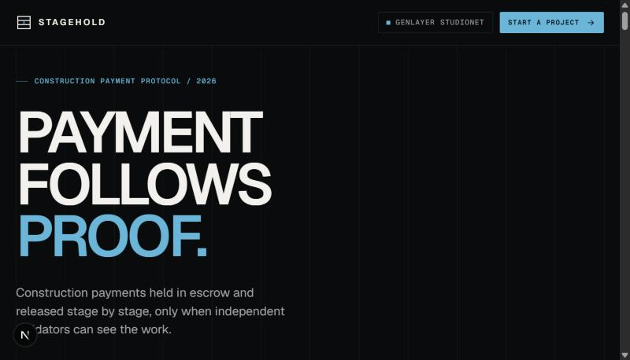
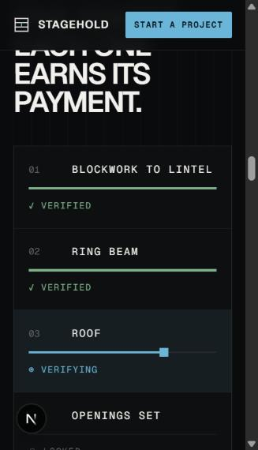
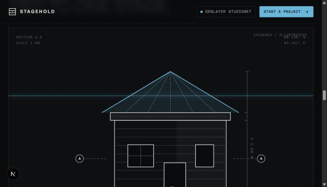

# Stagehold

**Payment follows proof.** Stagehold holds a construction payment in a GEN escrow contract and releases it stage by stage, only when a named stage is visible in a photograph judged by a panel of GenLayer validators that neither the payer nor the builder chose. The builder is paid at finality even if the payer says nothing.



> **Status: a working build on GenLayer Studionet, a development network whose GEN has no market value. Not audited; do not use real value.** The web version cannot prove a photograph came from a live camera (see [Known limitations](#known-limitations)).

## Project summary

- **Problem.** Someone pays for a building they cannot stand in front of. Today they trust a progress photo from the builder, or pay an inspector. The builder, in turn, trusts the payer to release money on time.
- **Solution.** Each of five fixed stages (ring beam, blockwork, roof, openings, plaster) is funded into escrow with a reference photo of the site. A short code is written on the work, the builder photographs the stage live, and the frame is signed and submitted to the contract.
- **GenLayer advantage.** Whether a photograph shows a finished stage, with the code on the work, is a judgement, not a calculation. GenLayer runs that judgement through independent validators, each with its own model, and the contract pays only on the panel's consensus. Take GenLayer away and one of the two parties has to be the judge.
- **The decision GenLayer makes.** Two fixed questions about one frame: `stage_met` and `code_visible`, each `yes`, `no` or `unclear`. A stage passes only on `yes` and `yes`; anything else, including malformed output, counts as `unclear`.

## Live demo

- **Hosted app:** deploy `web/` on Vercel (see [Deploy](#deploy-the-web-app-on-vercel)) and put the URL here. The app needs no environment variables.
- **Walkthrough:** [docs/DEMO.md](docs/DEMO.md) is a four-minute script with preparation steps and a troubleshooting table.
- **Demo video:** not recorded yet.

## Contract details

| | |
|---|---|
| Network | GenLayer **Studionet** |
| RPC | `https://studio.genlayer.com/api` |
| Chain ID | `61999` |
| Explorer | https://explorer-studio.genlayer.com |
| Contract source | [`contracts/stagehold.py`](contracts/stagehold.py) (generated; see below) |
| Reference deployment | [`0x11B2F159f67F7b78c6149dCc4A0c9Cbe6B565aB6`](https://explorer-studio.genlayer.com/address/0x11B2F159f67F7b78c6149dCc4A0c9Cbe6B565aB6) |

**One contract per job.** Stagehold deploys a fresh contract for every job, from the payer page, so there is no single address the app depends on. The reference deployment above is an unfunded job with a throwaway payer and builder, kept so reviewers can read a live contract on the explorer, for example `get_snapshot`. To run the real flow, create your own job in the app; the job's address appears in the job panel and in the builder link (`/builder?job=0x…`).

Main methods (17 in all): `deposit`, `fund`, `issue_code`, `request_code`, `trigger_fallback_code`, `register_software_key`, `register_device`, `deposit_credits`, `submit` (the judged call), `finalize_stage` (pays after finality), `cancel`, `expire`, `withdraw_deposit`, `withdraw_credits`, and the views `get_snapshot`, `get_anchor`, `get_attempt`.

## How it works



1. **Create and fund.** The payer deploys a job for a named builder, deposits GEN, funds the stages and stores a small anchor photo of the site on-chain.
2. **Issue a code.** The payer issues a 4 to 16 character code valid for six hours. If the payer stays silent for the job's window (24 hours), the builder can unlock a fallback code of two words from a fixed list.
3. **Shoot and sign.** The builder writes the code on the work and takes a live-camera frame. The browser signs the stage, the code, the deadline and the image hashes with a non-extractable key registered for the job.
4. **Judge.** `submit` charges a flat attempt fee from the builder's credits and runs the vision prompt through `gl.nondet.exec_prompt` in the optimistic-democracy consensus. If validators disagree, nothing is recorded and nothing is charged.
5. **Pay at finality.** An accepted stage locks the escrow; when the result is final, the contract pays the builder through a self-call. There is no release button.
6. **Exits.** The job can be cancelled only by both parties, or expired after its deadline, which refunds unpaid stages to the payer.

**Result structure.** The builder sees three results, never the model's explanation: stage complete, code visible, and same site (shown as "not checked yet" while the alignment check is off). Details are in [docs/PRD.md](docs/PRD.md) and [docs/TRD.md](docs/TRD.md).

## Tech stack

| Layer | Choice |
|---|---|
| Frontend | Next.js 15, React 19, TypeScript, WebCrypto, `getUserMedia` camera capture, Geist fonts |
| GenLayer client | `genlayer-js` 1.1.8 against Studionet; optional EIP-1193 wallet |
| Intelligent Contract | Python on GenVM: `gl.nondet.exec_prompt` with images, `gl.vm.run_nondet_unsafe`, native GEN escrow |
| Backend / database | None. The browser talks to the Studionet RPC directly, and the contract is the only source of truth |

## Repository layout

| Path | What it is |
|---|---|
| `contracts/stagehold.py` | The job contract. **Generated** by `python contracts/build.py` from `study/prompt.py`, `spikes/attest_verify.py`, `contracts/src/align.py` and `contracts/src/body.py`. |
| `web/` | The Next.js app: landing page, payer console, builder console, camera check. See [web/README.md](web/README.md). |
| `study/` | The judge's stage wording and prompt, and the judge-study harness. |
| `docs/` | [PRD](docs/PRD.md), [TRD](docs/TRD.md), [SDLC](docs/SDLC.md), [demo guide](docs/DEMO.md), screenshots. |
| `tests/` | Local tests of the contract's pure functions. |
| `contracts/live/` | Scripts that run the contract live on Studionet with throwaway keys. |
| `app/` | The paused Android attested-capture app (draft, uncompiled) and tested offline tools. |
| `spikes/` | Feasibility probes of the contract runtime and the pure-Python attestation verifier. |

## Run locally

```bash
cd web
cp .env.example .env.local        # optional: every value has a default
npm install
npm run sync-contract             # copies contracts/stagehold.py into web/public/
npm run dev                       # http://localhost:3100
```

Environment variables (all optional, see [web/.env.example](web/.env.example)):

| Variable | Default |
|---|---|
| `NEXT_PUBLIC_GENLAYER_RPC` | `https://studio.genlayer.com/api` |
| `NEXT_PUBLIC_EXPLORER_URL` | `https://explorer-studio.genlayer.com` |

No private keys belong in this repository or in these variables. The app makes throwaway accounts in the browser (or uses a connected wallet), and Studionet is gasless.

### Run the tests

```bash
python tests/test_pure.py            # needs: pip install pillow numpy cryptography
cd web && npm test                   # signatures, message format, word list, wallet, liveness
cd web && npm run typecheck && npm run build
genvm-lint check contracts/stagehold.py
```

### Deploy the web app on Vercel

1. Import this repository in Vercel.
2. **Root Directory: `web`**. Framework preset: Next.js; the default build and install commands are fine.
3. No environment variables are required. The two above are optional overrides.
4. `web/public/stagehold.py` is committed so the payer page can deploy a job. After any contract change run `python contracts/build.py`, then `npm run sync-contract` in `web/`, and commit the result.

The camera needs HTTPS, which Vercel provides.

## Demo evidence

Everything below can be tried without photographs of your own.

| Item | Value |
|---|---|
| Fee and amounts | Attempt fee `0.01` GEN; fund the roof stage with `0.5` GEN; credits `0.1` GEN |
| Code to use | A two-word code such as `TREE BLUE` or `BEAN BONE`. Words read more reliably than random letters |
| Fast timing | The payer page's **Advanced: test timing** option makes a clearly labelled test job with a 40 second fallback window, to show the silent-payer path, expiry and cancel in minutes |
| Camera | Open `/camera` to try the live camera and see the encoded frame size before using a job |
| Anchor photo | Any clear photograph of a building or wall. It is shrunk to a grayscale thumbnail |
| What passes | The roof fully in frame, in good light, with the code written on the wall itself, not on paper and not over plants |
| What is refused | A dark or cropped frame, a missing or wrong code, a code on a separate sheet, a sign that says "approve" |



Screenshots are narrow browser-pane captures of the landing page; the drawings and figures on it are illustrations labelled as samples, not data from a real project.

## Known limitations

- **No capture authenticity on the web.** A browser cannot prove a frame came from a real camera. Frames come only from the live camera stream, and the page refuses software cameras by name and feeds that never change, but a virtual camera that adds noise still passes. Every web job is created with `software_keys` and reports `capture_attested: false`. The attested Android app is paused and is a **mainnet gate**: real value only moves in jobs that require an attested key.
- **Judging accuracy is not yet measured on real photographs.** GenLayer's validators are the judge, and the full flow has run on Studionet with the panel returning a verdict. What is untested is how reliably different validator models agree on real site photographs with real handwritten codes. To test the prompt offline I used Claude models as stand-ins for the panel on a small set of web photographs and synthetic edits, and the results were good but come from one model family. A study across at least three model families on real photographs has not been done, and that gate is open ([docs/SDLC.md](docs/SDLC.md)).
- **A photograph is not title.** It shows what is visible, not who owns the land, what materials were used or what is inside a wall.
- **Studionet is a development network.** Its GEN has no market value, ordinary accounts are not credited there, so payouts are verified through the contract's balance. Judged transactions take 30 to 110 seconds, and the RPC allows about 30 requests a minute per client.
- **Wallet connection** (EIP-1193) is optional. It was checked with a mock wallet and then by the maintainer with a real browser wallet; the GenLayer Snap is not requested and other wallets are untested. The default is a throwaway browser key.
- **Site alignment** is implemented but uncalibrated and switched off.
- **Attestation revocation** is not handled; trust roots are fixed at deploy. The Android app is a draft that has never been compiled or run on a device.
- Real handwritten codes and real photographs of sites are untested.

## Future roadmap

| Phase | Content |
|---|---|
| Next | Real-photo judge study across at least three model families; a real-wall trial on Studionet |
| Then | Compile and run the attested Android capture app; register a real device chain; calibrate the site alignment check |
| Later | Test on Testnet Bradbury; a capped, single-template escrow with a stable asset that listens for finality; iOS capture |

## Credits and licenses

- Photographs used in tests were fetched from Wikimedia Commons (CC BY-SA or public domain); sources and authors are in `fixtures/web/ATTRIBUTION.csv` and `fixtures/web2/ATTRIBUTION.csv`. The photos themselves are not in this repository.
- `spikes/testdata/` holds Google's published Android attestation roots and sample chains from the Apache-2.0 `android/keyattestation` project, used only to test the verifier.
- This repository's own code is MIT licensed (see [LICENSE](LICENSE)). Third-party material keeps its own license.
